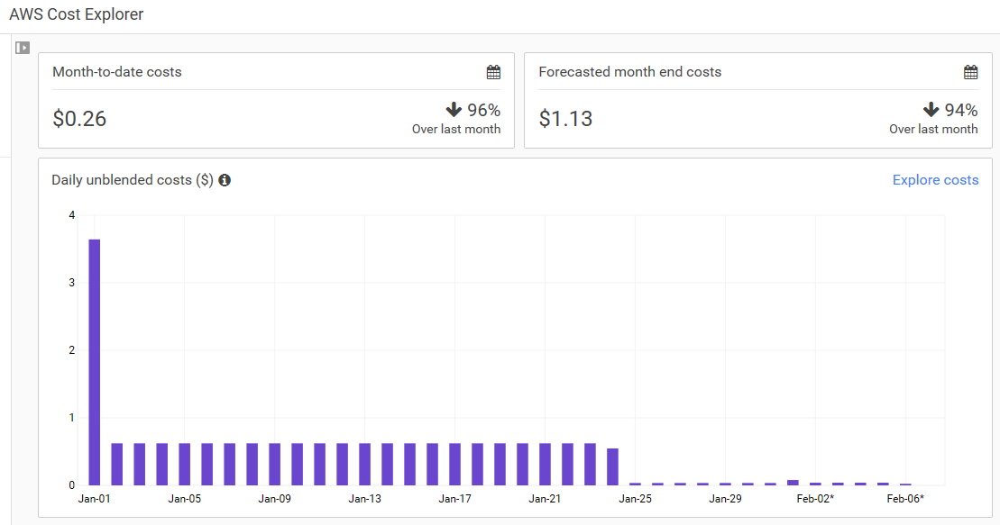

# Infrastructures
## Domain name 
torahwaypodcast.org.uk is registered with 1and1. 

## Hosting
Hosted as static website on AWS S3

Saved 94% cost since migrated from Elastic Beanstalk to AWS Lambda + S3

# Operations
* Feed is at http://rss.torahwaypodcast.org.uk/ (CNAME of rss.torahwaypodcast.org.uk.s3-website-eu-west-1.amazonaws.com + default document = rss.xml)
* Feed is generated by an AWS lambda function triggered every 15 min. The function
* * read the torah way website
* * parses the HTML to exract shiurim 
* * writes the RSS feed based on shiurim information 
* * stores the feed as rss.xml in an AWS S3 bucket.

# Dev environment:
* .NET 4.5

# Ideas for future delvelopment:
## Shiur File size
Just do a HEAD request on each URL. Easy!
## Shiur duration
Need to download each shiur. Or at least the beginiing of it and read the header.

Need architecture change to update only new shiurim. Can't re-downloadthe whole website every 15 min!

## iTunes feed
iTunes-specific tags in feed are already supported.

iTunes does NOT support wma file format. But most shiurim are in this format. Supporting iTunes would need:
* transcoding shiurim from wma to mp3
* hosting the mp3 shiurin ourselves.

Data persistence. 
 * <s>Everything is loaded in memory. Then lost when IIS appl pool is recycled, which probably happens very often (3 min) in cloud environment.</s>
 * Don't need to use database for persistance at the moment. only 1 table.
 * Might still be best for performance. 
 * Probably workth looking into if was have a separate worker trancoding and/or updating shiur duration

## Other feeds
**Edgware branch**: Looks like same HTML template. SHould be easy. 

**Manchester** Completely different HTML. Need to write a different parser.

**Gatshead**: site not updated since 2013

## Crazy (but exciting) ideas:

Add mugshot of the speaker taken from the weekly poster
* use Azure Cognituve API to detect faces?
* How to match face with shiur? 